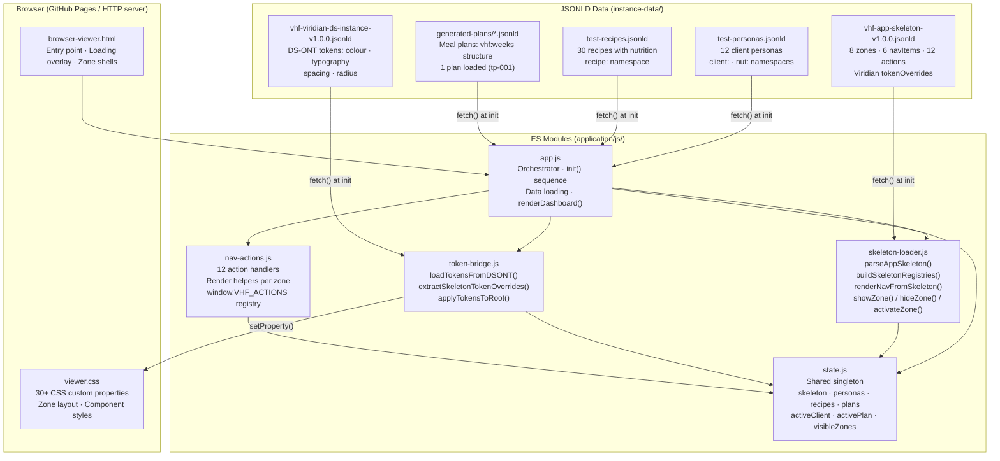
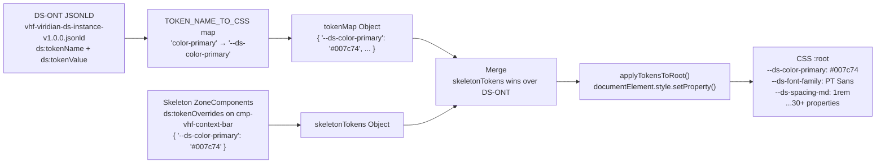

# PFI-VHF-ARCH: Application Architecture Guide

**Product Code:** PFI-VHF
**Document Type:** ARCH — Architecture Guide
**Version:** v1.0.0
**Date:** 2026-03-09
**Status:** Active
**Epic Refs:** Epic 2 (#26) · Epic 4 (#28)
**Author:** Design Director + Claude Code

---

## Overview

The VHF Nutrition Coaching App is a **standalone, zero-build-step, skeleton-driven web application** — the first PFI instance to deliver a fully operational app outside the Azlan PFC visualiser.

Key architectural principles:
- **No bundler.** Native ES modules (`type="module"`), no webpack/vite/rollup.
- **Skeleton-driven.** All zones, nav items, and actions are declared in JSONLD; the browser interprets them at runtime.
- **Token-bridged.** Brand colours, typography, and spacing are loaded from DS-ONT JSONLD and applied as CSS custom properties — no hardcoded values.
- **Standalone PFI instance.** Inherits PFC toolkit patterns (skeleton loader, token bridge, zone framework) but does not import from the Azlan visualiser.
- **File-based data.** JSONLD files for personas, recipes, and plans. No database required for MVP (Supabase deferred to Epic 8).

---

## System Architecture Diagram



---

## Module Dependency Map

```
app.js
├── imports state.js
├── imports skeleton-loader.js  (loadAppSkeleton, renderNavFromSkeleton, initZoneVisibility)
├── imports token-bridge.js     (initTokenBridge)
└── imports nav-actions.js      (VHF_ACTIONS)

skeleton-loader.js
└── imports state.js

token-bridge.js
└── imports state.js

nav-actions.js
├── imports state.js
└── imports skeleton-loader.js  (showZone, hideZone, activateZone)

state.js
└── (no imports — shared singleton)
```

All modules load via the single `<script type="module" src="js/app.js">` tag in the HTML. ES module resolution handles transitive imports.

---

## Zone Framework

### Zone Types

| Type | CSS Class | Behaviour | Used By |
|------|-----------|-----------|---------|
| Fixed | `.zone-fixed` | Always in document flow, fills assigned grid area | Dashboard (001), Meal Plan (002) |
| Sliding — Right | `.zone-sliding.from-right` | Slides in from right edge, overlaps main content | Client Profile (003), Recipe Browser (004), Shopping List (005) |
| Sliding — Left | `.zone-sliding.from-left` | Slides in from left edge | Coach Panel (006), Quality Dashboard (007) |
| Overlay | `.zone-overlay` | Fixed position float layer, highest z-index | AI Chat (008) |

### Zone Registry

| Zone ID | Name | Default Visible | Type | Notes |
|---------|------|:--------------:|------|-------|
| Z-VHF-001 | Dashboard | ✅ Yes | Fixed | Default landing view |
| Z-VHF-002 | Meal Plan Viewer | No | Fixed | Activated on client select with plan |
| Z-VHF-003 | Client Profile | No | Sliding-Right | Activated on client select without plan |
| Z-VHF-004 | Recipe Browser | No | Sliding-Right | Nav action: `showRecipeBrowser` |
| Z-VHF-005 | Shopping List | No | Sliding-Right | Nav action: `showShoppingList` |
| Z-VHF-006 | Coach Panel | No | Sliding-Left | Nav action: `showCoachPanel` |
| Z-VHF-007 | Quality Dashboard | No | Sliding-Left | Nav action: `showQualityDashboard` |
| Z-VHF-008 | AI Chat Overlay | No | Overlay | Nav toggle: `toggleNutritionChat` |

### Zone Visibility Rules

- `initZoneVisibility(skeleton)` — called once at startup, sets state from `ds:defaultVisible` flags.
- `activateZone(zoneId)` — shows one zone, hides all others in `mainZones` list. Used for primary navigation.
- `showZone(zoneId)` / `hideZone(zoneId)` — show/hide without affecting other zones (for panels/overlays).
- `toggleZone(zoneId)` — flip current visibility state.

Zone state is tracked in `state.visibleZones` (a `Set<string>`).

---

## Token Bridge Architecture



### Priority Order (highest wins)

1. Skeleton `ds:tokenOverrides` on ZoneComponents (VHF Viridian brand)
2. DS-ONT instance JSONLD primitive/semantic tokens
3. `viewer.css` `:root` defaults (fallback if files fail to load)

---

## Application Init Sequence

```
1. DOMContentLoaded → init()
2. fetch vhf-app-skeleton-v1.0.0.jsonld
   → parseAppSkeleton() → buildSkeletonRegistries() → state.skeleton populated
3. initTokenBridge(tokenPath, skeleton)
   → fetch DS-ONT JSONLD → extract skeleton overrides → merge → apply to :root
4. renderNavFromSkeleton(skeleton, navContainer)
   → L4-VHF layer → 6 nav buttons → window.VHF_ACTIONS[action] wired deferred
5. initZoneVisibility(skeleton)
   → Z-VHF-001 shown (defaultVisible=true) → all others hidden
6. Promise.all([ loadPersonas(), loadRecipes(), loadPlans() ])
   → fetch 3 JSONLD files → filter → populate state.personas, state.recipes, state.plans
7. renderDashboard()
   → 4 stat cards + avg kcal card → client card grid (12 cards)
8. window.VHF_ACTIONS = VHF_ACTIONS → expose for nav click handlers
9. hideLoading() → show #vhf-app → state.isLoading = false
```

---

## File & Directory Structure

```
pfi-vhf-nutrition-app-dev/
├── application/                          ← Browser app root
│   ├── browser-viewer.html               ← Entry point (serve from repo root)
│   ├── css/
│   │   └── viewer.css                    ← CSS custom properties + all zone styles
│   ├── js/
│   │   ├── app.js                        ← Orchestrator (main entry point)
│   │   ├── state.js                      ← Shared singleton state
│   │   ├── skeleton-loader.js            ← Skeleton parse, registry, zone show/hide
│   │   ├── token-bridge.js               ← DS-ONT → CSS var bridge
│   │   └── nav-actions.js                ← 12 action handlers, zone render helpers
│   └── vhf-app-skeleton-v1.0.0.jsonld   ← App skeleton (zones, nav, actions)
│
└── instance-data/                        ← JSONLD data files
    ├── tokens/VHF-DESIGN-SYSTEM-ONT/
    │   └── vhf-viridian-ds-instance-v1.0.0.jsonld   ← DS-ONT brand tokens
    └── ontologies/VHF-RECIPE-MEALPLAN-ONT/
        ├── test-data/
        │   ├── test-personas.jsonld                   ← 12 client personas
        │   └── test-recipes.jsonld                    ← 30 recipes
        └── generated-plans/
            └── meal-plan-tp-001-2026-02-26.jsonld     ← Sarah Mitchell plan
```

All data paths in `app.js` `PATHS` object are relative to `application/browser-viewer.html`. The HTTP server **must be started from the repo root** (`pfi-vhf-nutrition-app-dev/`) so that `../instance-data/` resolves correctly.

---

## Key Design Decisions

| # | Decision | Rationale |
|---|----------|-----------|
| D-ARCH-1 | No bundler — native ES modules | Zero build step, works on GitHub Pages, mirrors PFC visualiser pattern |
| D-ARCH-2 | Standalone (not embedded in Azlan) | VHF is a separate PFI product, not a panel in the visualiser |
| D-ARCH-3 | Skeleton JSONLD drives zones + nav | Enables PFC cascade inheritance; zones declared in data not HTML |
| D-ARCH-4 | Token bridge applies CSS vars at runtime | Brand can be updated by changing JSONLD without touching CSS |
| D-ARCH-5 | window.VHF_ACTIONS deferred registry | Actions wired at click time, not wire time — avoids circular module deps |
| D-ARCH-6 | File-based JSONLD for MVP (no DB) | Reduces Epic 8 dependency; Supabase added later without code refactor |
| D-ARCH-7 | State as shared singleton (state.js) | Simple pattern for a small app; no reactive framework overhead |

---

## CSS Custom Property System

All visual tokens are driven by `--ds-*` custom properties. The full set is documented in `viewer.css` `:root`. Key groups:

| Group | Prefix | Count | Example |
|-------|--------|:-----:|---------|
| Colour | `--ds-color-*` | 5 | `--ds-color-primary: #007c74` |
| Surface | `--ds-surface-*` | 4 | `--ds-surface-brand: #007c74` |
| Text | `--ds-text-*` | 4 | `--ds-text-primary: #1a1a1a` |
| Border | `--ds-border-*` | 2 | `--ds-border-default: #e5e7eb` |
| Font | `--ds-font-*` | 6 | `--ds-font-family: 'PT Sans', sans-serif` |
| Spacing | `--ds-spacing-*` | 5 | `--ds-spacing-md: 1rem` |
| Radius | `--ds-radius-*` | 4 | `--ds-radius-lg: 0.75rem` |
| Shadow | `--ds-shadow-*` | 2 | `--ds-shadow-sm: 0 1px 2px rgba(0,0,0,0.05)` |

---

## Viridian Brand Identity

| Token | Value | Usage |
|-------|-------|-------|
| `--ds-color-primary` | `#007c74` | Viridian teal — buttons, badges, borders, icons |
| `--ds-color-secondary` | `#f16a21` | Viridian orange — accent, highlights |
| `--ds-color-primary-hover` | `#006560` | Darker teal for hover states |
| `--ds-color-primary-light` | `#e6f4f3` | Light teal background for tags, highlights |
| `--ds-font-family` | `'PT Sans', sans-serif` | Google Fonts, loaded in `<head>` |
| `--ds-surface-brand` | `#007c74` | Full-colour brand surface |

---

*Generated: 2026-03-09 · VHF Nutrition Coaching App · `pfi-vhf-nutrition-app-dev`*
