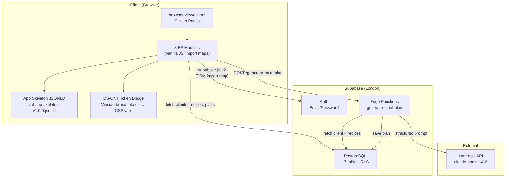

# PFI-VHF-ARCH: Application Architecture

**Product Code:** PFI-VHF
**Document Type:** ARCH — Architecture Overview
**Version:** v2.0.0
**Date:** 2026-04-10
**Status:** Active
**Scope:** Full application stack — static UI, Supabase backend, Edge Functions
**Author:** Design Director + Claude Code

---

## Document Control

| Field | Value |
|---|---|
| Tier | PFI-VHF |
| Product | VHF Nutrition App |
| Classification | Internal |
| Supersedes | v1.0.0 (pre-Supabase static-only architecture) |

---

## 1. Architecture Decision: Static App Is the Production UI

The canonical production UI is the static `application/browser-viewer.html`, deployed automatically via GitHub Pages. The Next.js app in `app/` (29 files, builds clean) is retained as a future upgrade path and internal tooling sandbox. It is **not** the demo, not the production target, and not under active development.

**Rationale:** Zero hosting cost, no build step, instant deploy on push, proven working with Supabase Auth + data fetching. The static app already implements all 8 zones with App Skeleton + DS-ONT token bridge.

---

## 2. Architecture Diagram



---

## 3. Component Inventory

### 3.1 JS Modules (`application/js/`)

| Module | Purpose |
|---|---|
| `app.js` | Entry point. Orchestrates skeleton load, token bridge, zone init, data fetch |
| `state.js` | Centralised application state (clients, recipes, plans, active zone) |
| `skeleton-loader.js` | Loads App Skeleton JSONLD, renders nav bar, initialises zone visibility |
| `token-bridge.js` | Maps DS-ONT Viridian brand tokens to CSS custom properties |
| `nav-actions.js` | Zone navigation handlers, exposed as `window.VHF_ACTIONS` |
| `supabase-client.js` | Supabase client init, `fetchClients`, `fetchRecipes`, `fetchPlans` |
| `auth.js` | Login form handler, session management, auth state listener |
| `admin-overlay.js` | Dev/admin overlay for debugging state |

### 3.2 Zones (8 active)

| Zone ID | Zone Name | Status |
|---|---|---|
| Z-VHF-001 | Dashboard | Built — 12 client cards |
| Z-VHF-002 | Client Profile | Built — health data, macros, allergens |
| Z-VHF-003 | Recipe Browser | Built — 30 recipes, search/filter |
| Z-VHF-004 | Plan Viewer | Built — daily meal breakdown, macros |
| Z-VHF-005 | Shopping List | Built — grouped ingredients |
| Z-VHF-006 | Quality Dashboard | Built — macro adherence, variety, allergen check |
| Z-VHF-007 | Coach Panel | Built — client list, generate/approve/reject |
| Z-VHF-008 | Settings | Placeholder |

---

## 4. Data Flow

1. **Auth:** User submits email/password via login form. `auth.js` calls `supabase.auth.signInWithPassword()`. On success, login overlay hides, app initialises.
2. **Fetch:** `supabase-client.js` fetches `vhf_clients`, `vhf_recipes`, and `vhf_meal_plans` (with nested days/entries) for the authenticated coach. Data stored in `state.js`.
3. **Render:** Zone renderers read from state and build DOM. Nav actions toggle zone visibility.
4. **Actions:** Coach clicks "Generate Plan" in Z-VHF-007. App POSTs to the `generate-meal-plan` Edge Function with `{ client_id }`.
5. **Edge Function:** Fetches client profile + suitable recipes from DB, builds a structured prompt, calls Claude, parses JSON response, saves plan/days/entries to DB, returns plan JSON.
6. **State Refresh:** On plan generation or approve/reject, app re-fetches plans from Supabase and re-renders.

---

## 5. Database Schema

**17 tables across 6 groups:**

| Group | Tables | Notes |
|---|---|---|
| Core | `vhf_coaches`, `vhf_clients` | Coach-client relationship. BMI computed column. |
| Recipes | `vhf_recipes` | 30 seeded. GIN indexes on diets/allergens. |
| Meal Planning | `vhf_meal_plans`, `vhf_meal_plan_days`, `vhf_meal_plan_entries` | Hierarchical: plan → days → entries (recipe per meal slot). |
| Shopping | `vhf_shopping_lists`, `vhf_shopping_items` | Derived from plans. Aisle grouping. |
| Agents | `vhf_agent_sessions`, `vhf_agent_messages` | Conversation history for CAST/advisor interactions. |
| Progress | `vhf_progress_logs` | Weight, adherence, mood, energy. Unique per client+date. |
| Payments | `vhf_stripe_customers`, `vhf_subscriptions`, `vhf_subscription_seats`, `vhf_payments`, `vhf_stripe_events` | Full Stripe integration schema. 3 tiers: included_pt, nutrition_only, enterprise. |

**RLS:** All tables have row-level security enabled. Coach sees own record, own clients, own plans. Recipes readable by all authenticated users. Stripe events restricted to service role.

**Seed Data:** 1 coach (James Kerby), 12 clients, 30 recipes, 1 generated plan (Sarah Mitchell).

---

## 6. Edge Functions

### generate-meal-plan

| Field | Value |
|---|---|
| Path | `supabase/functions/generate-meal-plan/index.ts` |
| Method | POST |
| Input | `{ client_id: string, duration_days?: number }` |
| Model | claude-sonnet-4-6 (temperature 0.3, max 8000 tokens) |
| Output | Structured JSON plan saved to DB + returned to client |
| CORS | `ajrmooreuk.github.io`, `localhost:5173`, `127.0.0.1:5173` |
| Secret | `ANTHROPIC_API_KEY` (must be set via `supabase secrets set`) |

The Edge Function uses a single Claude call with all suitable recipes in context. It does **not** use the agentic tool-use loop described in the original skill design.

---

## 7. Honest Inventory

### Built and Working

- Static app: login, dashboard, client profiles, recipe browser, plan viewer, shopping list, quality dashboard, coach panel (8/8 zones)
- Supabase: 17 tables, seed data (1 coach, 12 clients, 30 recipes, 1 plan), RLS policies, `updated_at` triggers
- Edge Function: `generate-meal-plan` (code complete, deployed)
- Promotion pipeline: dev-to-test and dev-to-prod (tested, PRs merged)
- DS-ONT token bridge + App Skeleton loader
- Auth: email/password via Supabase

### Not Built

- Stripe payments: schema exists, no Stripe products/keys configured, checkout/webhook not wired in the static app
- Agent tools integration: Edge Function uses single Claude call, not the multi-tool agentic loop
- Coach workflow lifecycle: generate button exists, approve/reject wired to state + Supabase, but no full lifecycle UI (Epic 6)
- NUT-ONT namespace migration (Epic 3)
- DS-ONT v3.0.0 upgrade (Epic 4 F4.1)
- Progress tracking UI: `vhf_progress_logs` table exists, no UI
- PMF/feedback collection (Epic 8)
- 11 of 12 clients have no generated plans

### Orphaned / Drift

- **Next.js app (`app/`):** 29 files, builds clean, contains duplicate agent layer, Stripe routes, dashboard pages. Decision: keep as future upgrade path, not active development. Not deployed, not the demo.

---

## 8. Repo Structure

```
pfi-vhf-nutrition-app-dev/
  application/                  ← Production UI (GitHub Pages)
    browser-viewer.html         ← Entry point
    css/viewer.css              ← Styles (DS-ONT token vars)
    js/                         ← 8 ES modules
    vhf-app-skeleton-v1.0.0.jsonld  ← App Skeleton definition
  supabase/
    migrations/                 ← SQL migrations (YYYYMMDDHHMMSS format)
    functions/                  ← Edge Functions (Deno/TS)
  instance-data/
    config/pfi-config.json      ← PFI instance configuration
    tokens/                     ← DS-ONT brand tokens
  app/                          ← Next.js app (NOT production — future path)
  PBS/                          ← Programme Breakdown Structure
    STRATEGY/                   ← Strategy documents
  promotion/                    ← CI/CD promotion workflows
  scripts/                      ← Utility scripts
  pfc-core/                     ← PFC core dependencies
```
